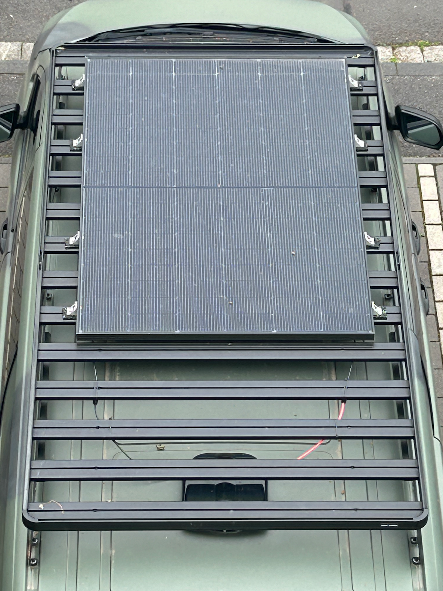
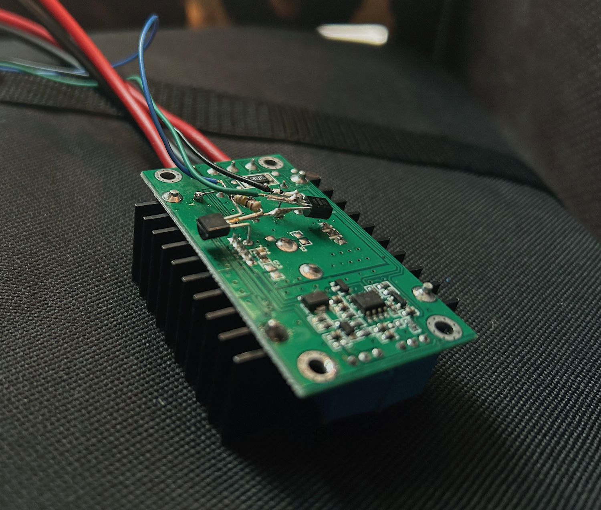
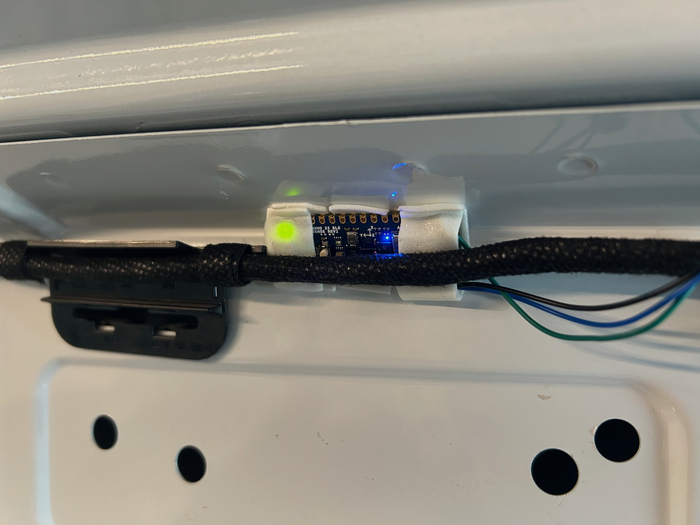
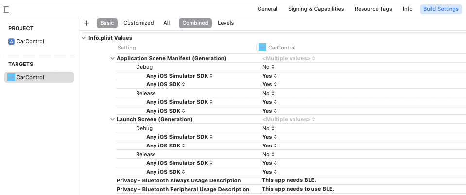
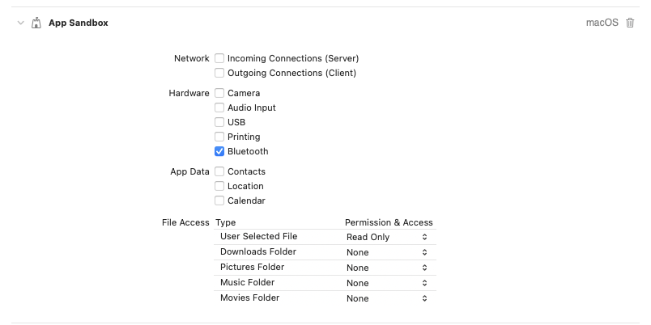
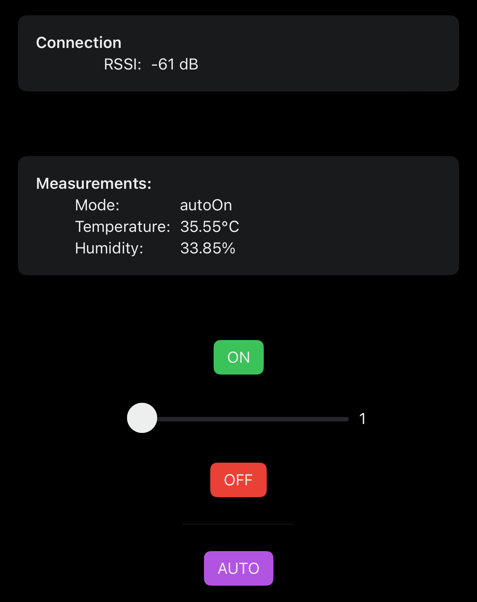

# Building a Smart Car Fan

Earlier this year I installed a 435W solar module on top of my car, charging a 2.2kWh power station via the two wires you can see running toward the back of the roof. In order to make do with only one hole in the roof (and have an easy plan of how to keep it rainproof) I decided to pass these rather stiff wires through extra holes drilled in the fan’s plastic housing. This all worked out quite nicely!

Now we have more than enough power to charge our electronic devices while on the road (or off the grid). In the future this should be enough to power a small fridge as well — when the fridge is needed the solar module will also produce the required power. There was just one issue: I didn’t like the stress on the power station due to the car heating up to 60°C or more in summer. The solution is to simply provide enough circulation to keep the air temperature inside not too far from the temperature outside. But switching on and off the fan manually is annoying, and it may not even be possible when I’m not staying near my car for a few days.

So the goal was to add some electronics that would do this for me. The power station wouldn’t be challenged at all providing electricity for some embedded processor and a thermal sensor. And while we’re at it we could also regulate the voltage to be able to throttle the fan from its usual 70W (which sounds like an idling airplane engine) to something more tolerable while staying inside the van. And of course all this should be possible with an iPhone app.

## Switching power to a 12V / 6A load

Asking the wizards at the [local maker space](https://flipdot.org) quickly converged on buying — not building — a DC-DC step-down converter (a.k.a. buck converter). These devices are quite efficient and cheap (I paid less than 10€), but they are highly integrated.

The two radiators dissipate the heat of a Schottky diode and an [XLSEMI XL4016E](https://www.alldatasheet.com/datasheet-pdf/pdf/763185/ETC2/XL4016E1.html), respectively. The latter basically takes a feedback signal to generate a pulse-width modulation signal that gates the input voltage via a power mosfet into the coil you see in the image, whereby cutting the supply will draw current from common (through the Schottky diode), filling the large capacitors such that the desired output voltage is reached. That voltage is selected by adjusting the potentiometer at the top right, setting a voltage divider such that the correct output voltage will result in a feedback of 1.25V.

At this point I thought that I’ll need to remove that potentiometer and connect instead a voltage divider that I can control from an embedded processor (e.g. a ladder of resistors with transistors in parallel). But the wizards convinced me that it is smarter to supply a PWM signal to the feedback pin instead:

- when I want the converter to work, let the pin float (i.e. do its usual thing)
- when I want it to stop working for a while, pull the pin to >2.2V (as is documented in the data sheet on page 8; a 1N4118 has a max. forward voltage of 1.1V)

When I tried doing this with an Arduino dev board at 5V I found that overriding the buck converter’s feedback signal in the second case requires a rather low impedance. This problem is exacerbated when running the Arduino nano (the device I’m trying out for this project) at its internally regulated 3.3V. So I had to revisit the electronics classes I took more than twenty years ago and with some experimentation I arrived at the following circuit:

The idea is to drive the gate of the right MOSFET to common when the Arduino supplies 3.3V on its output pin, which will deplete the channel and thus the output on the right will be floating. When the Arduino pin is pulled to common, the left MOSFET channel is depleted so that the 100kΩ resistor pulls the right MOSFET’s gate high, supplying the output pin with about 10V in my case (V_dd at 12V).

Using such a circuit on a breadboard I tried it out with the Arduino toggling its pin every 10ms. The oscilloscope revealed that while it only takes about 600µs to switch off the converter, it takes nearly 2ms to get it started again after the pin is pulled HIGH. This provides the parameters for the PWM we’ll use further down below. The finished setup consists of just three items soldered to the back side of the buck converter PCB (using 2N7000 transistors):

## Arduino programming

We have the means, now use them: the [Arduino nano 33 BLE sense](https://store.arduino.cc/products/arduino-nano-33-ble-sense) comes with 14 digital GPIO pins and various sensors, we’ll only use the [Renesas HS3003](https://www.renesas.com/us/en/products/sensor-products/environmental-sensors/humidity-temperature-sensors/hs3003-high-performance-relative-humidity-and-temperature-sensor) (temperature & humidity) for now.

Weirdly, the official Arduino library doesn’t quite work (I only got 0% relative humidity back), but fortunately the chip is quite easy to work with:

<https://github.com/rkuhn/car-puter/blob/efe66dd249affb8b05167e73e9073e67cb480014/fan-control/fan-control.ino#L218-L262>

The main interaction of this board shall happen via Bluetooth Low Energy, and I must say that I was very pleasantly surprised by how simple this is on Arduino. First declare the service and its characteristics, making sure to add the `BLENotify` flag for easy reading in the iPhone app later:

<https://github.com/rkuhn/car-puter/blob/efe66dd249affb8b05167e73e9073e67cb480014/fan-control/fan-control.ino#L56-L60>

Then some setup code to start the BLE infrastructure:

<https://github.com/rkuhn/car-puter/blob/efe66dd249affb8b05167e73e9073e67cb480014/fan-control/fan-control.ino#L93-L101>

In the main loop we only need to check whether some values were written and react:

<https://github.com/rkuhn/car-puter/blob/efe66dd249affb8b05167e73e9073e67cb480014/fan-control/fan-control.ino#L183-L209>

You can see the other places where `writeValue` is used to update the characteristics where applicable, notification of central device occurs in the background.

In `throttle` mode the `run_throttle` function is used. Instead of programming timer registers by hand I used the `mbed::Ticker` facility that comes with the nRF52840 firmware. The ISR is quite simple and short, the code is only enlarged by the switch statement that configures the slow fan speeds: recall that it takes 2ms to switch on the buck converter, so we need to keep the signal HIGH for at least 4ms (I tried 3ms but found that that generates some strange sound from the fan motor). Getting the voltage down far enough for really slow speeds means extending the period of being switched off — this is exacerbated by the huge capacitors on the converter that are eagerly charged at the beginning of the cycle when the feedback signal is strong, and by the fact that a slow fan drain the capacitors more slowly as well. On setting 1 we’d expect the voltage to be about 2/22th of 12V, but in reality it ends up around 5V.

<https://github.com/rkuhn/car-puter/blob/efe66dd249affb8b05167e73e9073e67cb480014/fan-control/fan-control.ino#L265-L319>

While scrolling you may find that the above word on sensor usage wasn’t entirely correct: just for the fun of it I tried out the gesture sensor so that the fan control can be switched between `on`, `off`, and `auto` modes at the flick of a finger. The rest of the main loop deals with the thermal hysteresis of switching on the fan when the temperature rises above 30°C and off when it falls below 29°C. I have tried this and found it to be nice: the fan kicks in for a bit every few minutes when the outside temperature is 22°C with an overcast sky, and it stays on while the sun shines on the car roof. To detect this I put the Arduino right up there:

## iPhone programming

This turned out to be quite a bit more complicated than all of the activities described above: Xcode is a complex and under-documented product, as are the Swift libraries. Once I had found [some](https://github.com/adafruit/Basic-Chat/tree/master/Basic%20Chat%20MVC) [examples](https://www.freecodecamp.org/news/ultimate-how-to-bluetooth-swift-with-hardware-in-20-minutes/) I got the basic structure implemented quite quickly:

<https://github.com/rkuhn/car-puter/blob/efe66dd249affb8b05167e73e9073e67cb480014/MacApp/CarControl/BLE.swift>

But of course BLE wouldn’t work out of the box, you need to _know_ that some localization keys need to be included in `Info.plist`, which you cannot (or at least shouldn’t) edit directly. You need to select the top-level project entry in the navigation tree and then edit the build settings:

This will lead to the dialogue being shown to the iPhone user whether the app may use Bluetooth (instead of crashing the app). The nice thing about Xcode is that the very same app can also be built for macos without any extra hassle. But of course that doesn’t quite work, as on that platform the request for Bluetooth needs to be registered under “Signing & Capabilities” instead:

But with these it all worked quite beautifully! Now I have an app on my iPhone with which I can control the fan from a distance of about 6–8m around the car.

(yeah, I’m not a master designer, but it gets the job done)
